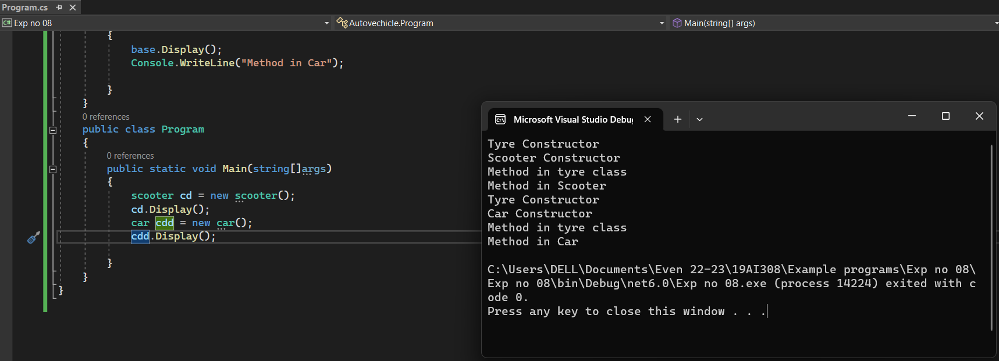

# HIERARCHICAL INHERITANCE

## AIM:
To write a C# program to print some messages using hierarchical inheritance
## ALGORITHM:
### Step 1:
Create a base class. 
### Step 2:
Create two child class. 
### Step 3:
Create a constructor in the base class and print a message. 
### Step 4:
Create a function in child class to print a message.
## PROGRAM:
Developed by : Shrruthilaya G

Register number : 212221230097
```C#
using System;
namespace Autovechicle
{
    public class tyre
    {
        public tyre()
        {
            Console.WriteLine("Tyre Constructor");
        }
        public virtual void Display()
        {
            Console.WriteLine("Method in tyre class");
        }
    }
    
    public class scooter : tyre
    {
        public scooter()
        {
            Console.WriteLine("Scooter Constructor");
        }

        public override void Display()
        {
            base.Display();
            Console.WriteLine("Method in Scooter");

            }
        }
    public class car : tyre
    {
        public car()
        {
            Console.WriteLine("Car Constructor");
        }

        public override void Display()
        {
            base.Display();
            Console.WriteLine("Method in Car");

        }
    }
    public class Program
    {
        public static void Main(string[]args)
        {
            scooter cd = new scooter();
            cd.Display();
            car cdd = new car();
            cdd.Display();
            
        }
    }
}
```

## OUTPUT:


## RESULT:
Thus, a C# program to print some messages using hierarchical inheritance is implemented successfully.